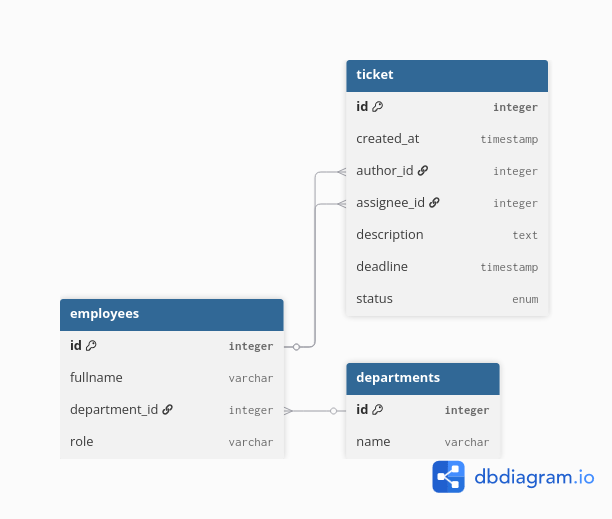
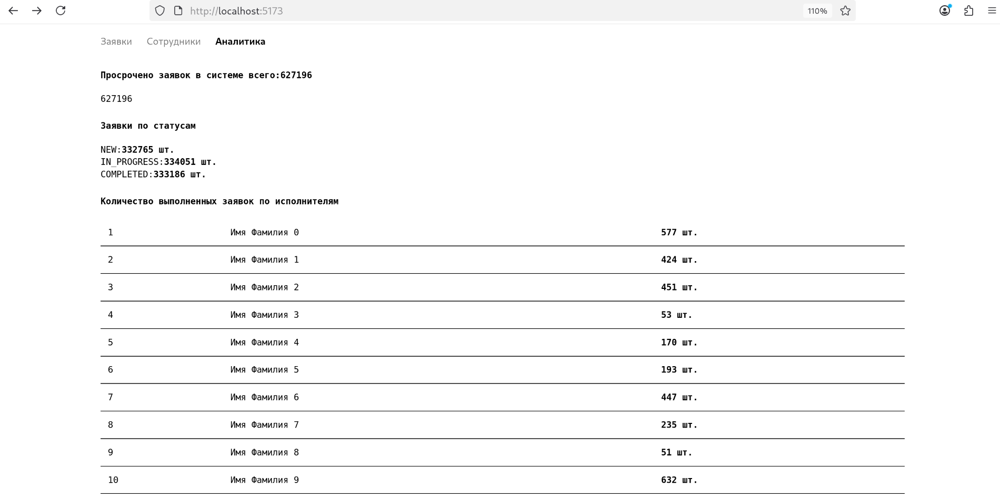
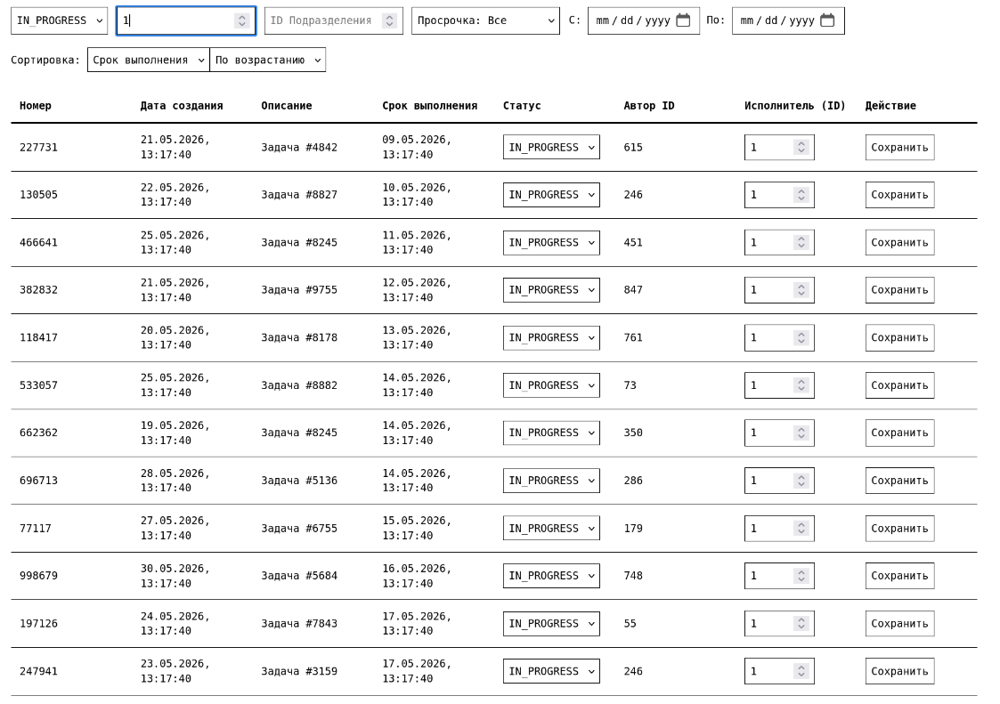
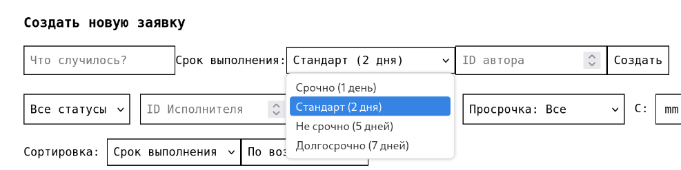

# СРМ (home edition)

## Инструкция по запуску

1. Склонируйте репозиторий (убедитесь, что у вас установлены Docker и Docker Compose):
```bush
git clone https://github.com/SushilovGit/test-ptmk-junior.git
cd test-ptmk-junior
```

2. Запуск контейнеров:
```bush
docker compose up --build
```

P.S. Генерация данных занимет достаточно много времени, если я не успел реализовать копирование через заготовленный CSV файл (~10 минут).

3. Доступ к приложению по адреcу: http://localhost:5173/

---

**Задача:** разработать приложение (консольное или веб) для учёта заявок сотрудников.

**Бизнес-процесс:**
- Заявка проходит следующие этапы: `Новая` → `В работе` → `Выполнена`
- Переход между статусами должен соответствовать бизнес-правилам. Например, заявка не может быть переведена из статуса «Новая» сразу в статус «Выполнена».

## Функциональные требования
Требования к базе данных
Спроектировать структуру базы данных таким образом, чтобы:
- отсутствовало необоснованное дублирование данных;
- использовались связи между сущностями;
- соблюдались принципы нормализации.



**1. Сотрудники**
Реализовать справочник сотрудников:
- ФИО;
- подразделение;
- должность.


**2. Заявки**
Реализовать создание заявок со следующими полями:
- номер;
- дата создания;
- автор;
- исполнитель;
- описание;
- срок выполнения;
- статус.

**3. Работа с заявками**
Реализовать возможность:
- изменить статус заявки с проверкой допустимости перехода;
изменить исполнителя;
- вывести список заявок с фильтрацией:
    по статусу;
    по исполнителю;
    по подразделению;
    по просроченным заявкам.

**4. Отчётность**

Сформировать отчёт:
- количество заявок по каждому статусу;
- количество просроченных заявок;
- количество выполненных заявок по исполнителям.




**Выполнить запрос:**
вывести все просроченные заявки конкретного исполнителя, находящиеся в статусе «В работе», отсортированные по сроку выполнения.
```
backend   | request: /tickets/filtered - time: 0.0097 sec
backend   | INFO:     172.19.0.1:59122 - "GET /tickets/filtered?sorted_order=asc&status=IN_PROGRESS&assignee_id=50&is_overdue=true HTTP/1.1" 200 OK
```



Время выполнения: 
- без оптимизации заняло **~0.271045 сек**
- с оптимизацией **~0.0097 сек**


**Как это было достигнуто:**
Индексы, просто индексы. По сути, мы пытаемся избежать необходимости чтения не нужных данных через разные способы сортировки. База данных тратит время только на чтение тех строк, которые действительно нужны для результата, игнорируя миллионы остальных. Так что мы получаем многократный прирост скорости.
Т.к. я использовал ORM, все индексы можно просмотреть по пути backend/src/models.py
Есть накладные расходы на это удовольствие (запросты на добавление будут дороже по времени, т.к. будет пересчет индексов), то ставить где попала их нельзя. Поэтому было принято решение установить их там, где потенциально будут чаще запросы по фильтрации.
Как пример, предложенный вами запрос на "просроченные заявки конкретного исполнителя, находящиеся в статусе «В работе», ...".
```py
# из class TicketORM(Base)
__table_args__ = (
        Index('idx_tickets_status_assignee_deadline', 'status', 'assignee_id', 'deadline'),
        Index('idx_tickets_deadline', 'deadline'),
    )
```
Также поставил индексы для связи между двумя таблицами: employees и departments, так как они тесно связаны друг с другом и часто между собой общаются. Это ускорит операцию JOIN в нашем запросе по `/employee`.


## Реализованного бизнес-процесс
Основной бизнес-процесс системы заключается в управлении жизненным циклом заявок (тикетов) внутри организации (хотя скорее это эммитация цикла).
Процесс состоит из следующих этапов:
- Создание заявки с статусом `NEW`;
- Назначение специалиста и переход в статус `IN_PROGRESS`;
- Исполнение и переход в статус `COMPLETED`.

## Бизнес правила
1. При удалении сотрудника из базы данных все созданные им заявки удаляются автоматически, предотвращая появление  записей сирот (использовал ondelete='CASCADE');
2. Требование к уникальным названиям департментов;
3. Статус заявки является строго типизированным (Enum: NEW, IN_PROGRESS, COMPLETED), что гарантирует корректность состояний и исключает возможность ввода произвольных, невалидных статусов.
4. Обязательные поля (ФИО сотрудника, описание заявки, дедлайн, связь с департаментом  и т.д.).


## Дополнительное задание (по желанию)

**1. заявка должна проходить согласование руководителем:**
*Добавить поле в таблицу заявок для согласования. Либо также по статусу или же bool, согласована (true) / не согласована (false)*
**2. необходимо хранить историю изменения статусов:**
*Новая таблица `TicketHistory` с полями ticket_id, status, changed_at, changed_by*
**3. сроки выполнения зависят от типа заявки:**
*Для создания заявок я сделал что то похожее, но просто на стороне фронтенда. Выбор срочности добавляет дни к дате и записывает как дедлайн*

*Либо если нужно на стороне backend, то опять же добавлять столбцы срочности заявки*
**4. требуется разграничение прав доступа (сотрудник, руководитель, администратор)**
*Выдаем роли пользователям заявок и прописывает дополнительную функцию (можно сделать декоратор для перехвата) на её проверку*